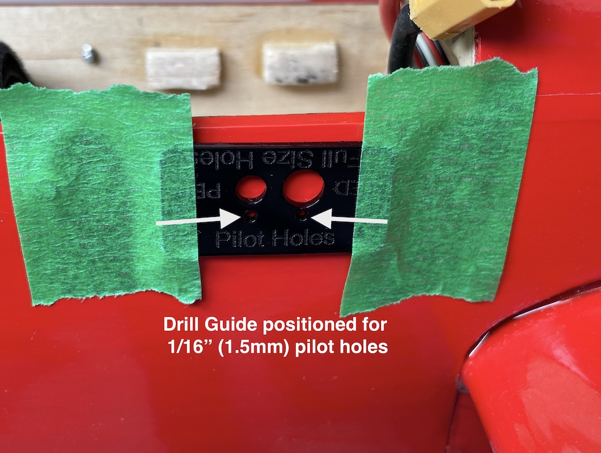
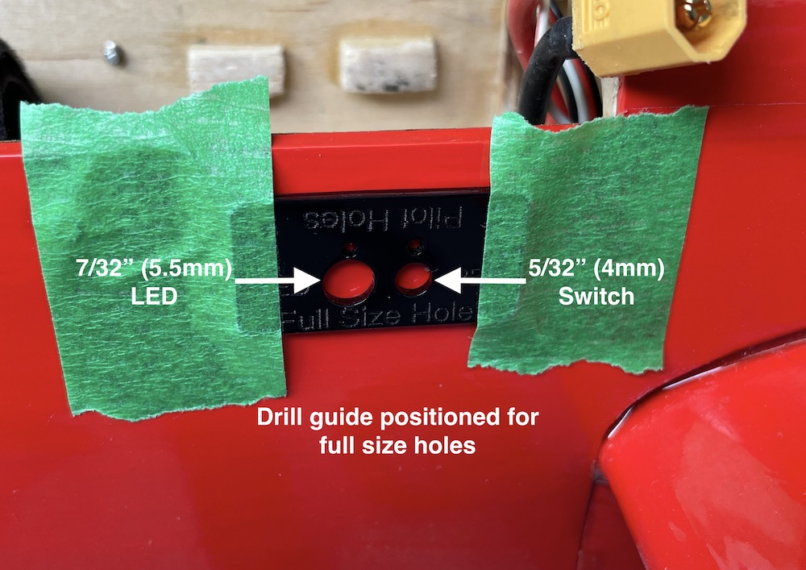
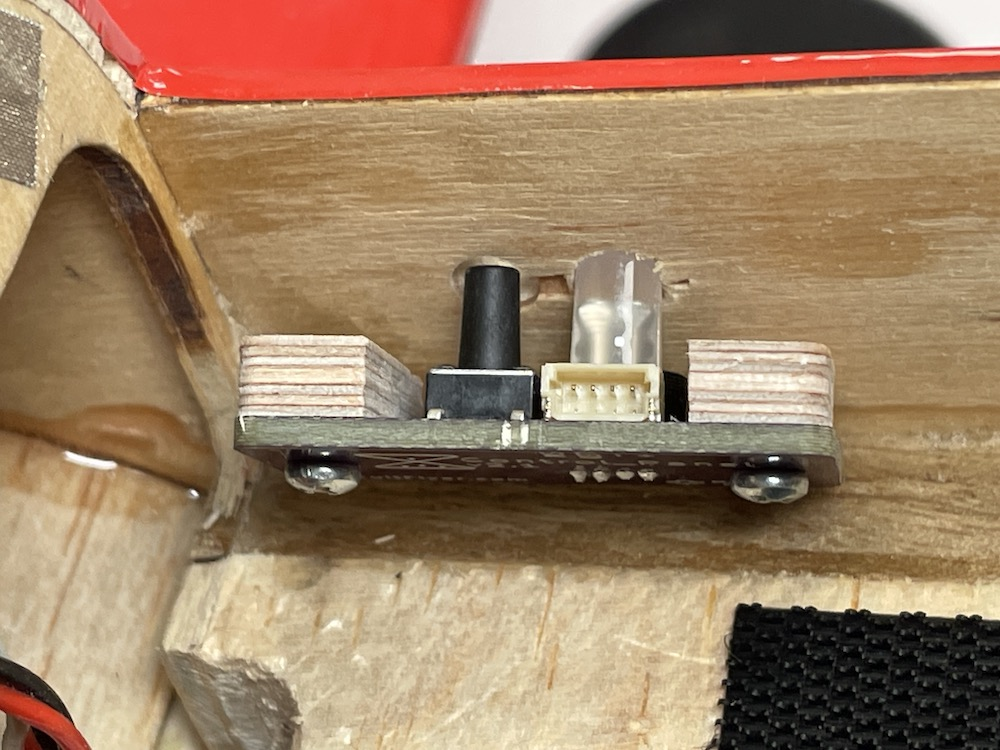
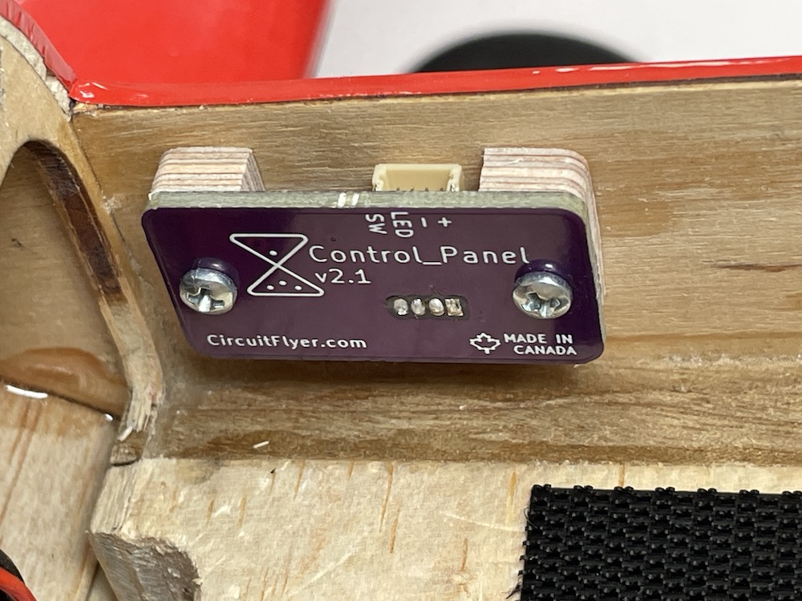
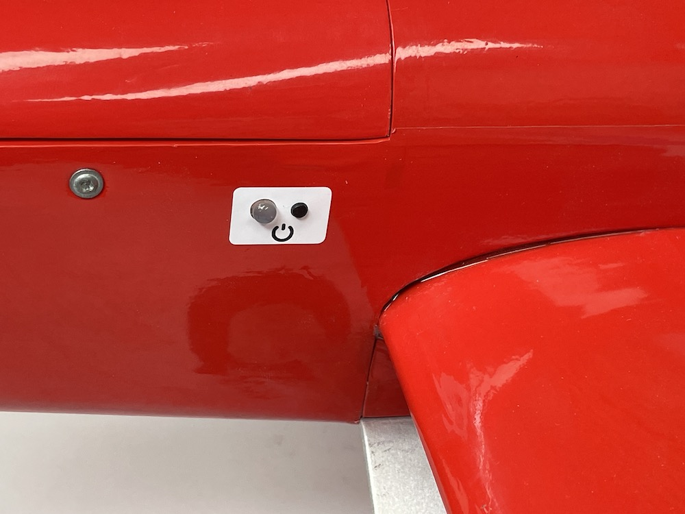
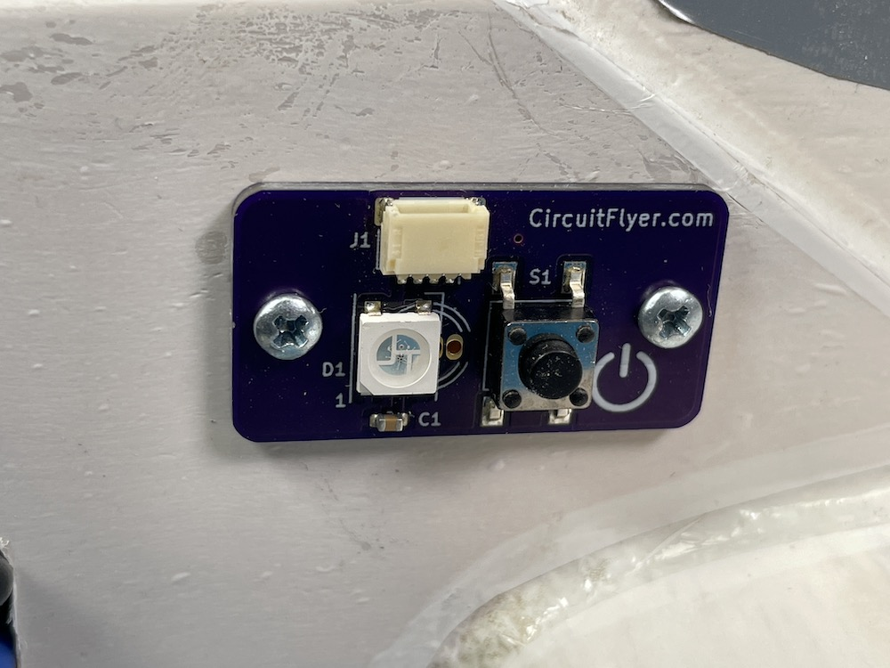



## Installation in a Full Fuselage Model ##

Choose a location on the airplane that is accessible and where the status indicator LED will be visible to the pilot from the centre of the flying circle.  The included wiring can reach up to 10" (26cm) from the timer mounting location.

Click [HERE](/Design%20Files/Contol_Panel_Drawing_-_v2.0.pdf){: download} for a dimensional drawing of the assembled PCB.

Use the supplied drill template to locate the position of the two holes to be drilled through the fuselage sides.  The template has two sets of holes; choose a set of holes that suit your technique. One set is used to locate small 1/16" (1.5mm) diameter pilot holes and the other set for the final suggested hole diameter; a 5/32" (4mm) drill for the switch and a 7/32 (5.5mm) drill for the LED should provide a little extra clearance for installation.

Don't worry if the area around the drilled holes is a little rough. The vinyl label provided should cover up any excessive gaps around the electrical components for a professional appearance.

Leave the plywood spacer blocks attached to the PCB.  Position the Contol_Panel assembly in place and glue the face of the spacer blocks to the inside wall of the fuselage.

Clean the outside surface of the fuselage around the switch and LED.  Carefully align and apply the vinyl label for a clean appearance.

{: .highlight }
**Caution:** The adhesive used on the label is very sticky. It is strongly suggested to use the 'wet' method to allow an opportunity to correctly position the label.  Wet the fuselage area and the back of the label with a soapy water solution (a popular blue window cleaner works very well) then position and align the label before pressing down and blotting off the excess water.  Let dry.

## Installation on a Profile Fuselage Model ##

The Control_Panel version for external mounting uses a low profile addressable LED and shorter pushbutton switch.  Installation is straight forward as the PCB can be mounted with velcro or using the included #2 x 3/8" screws.  Hint: for better grip, use a drop of thin CA glue to 'harden' the threaded holes when screwing into soft balsa wood.

{: .highlight }
**Important:** The shorter addressable LED used on the profile fuselage version of the Control_Panel is an "GRB" Neopixel.  Refer to the Climb_and_Dive instruction manual under the section titled [Advanced Modifications, Additional Parameters Accessible within the Program Code][2] to change the variable named **pixel_colour** from "RGB" to "GRB".  This is required otherwise the red and green lights will be reversed.

[2]: https://circuitflyer.com/Climb_and_Dive/docs/Advanced%20Modifications.html#additional-parameters-accessible-within-the-program-code
