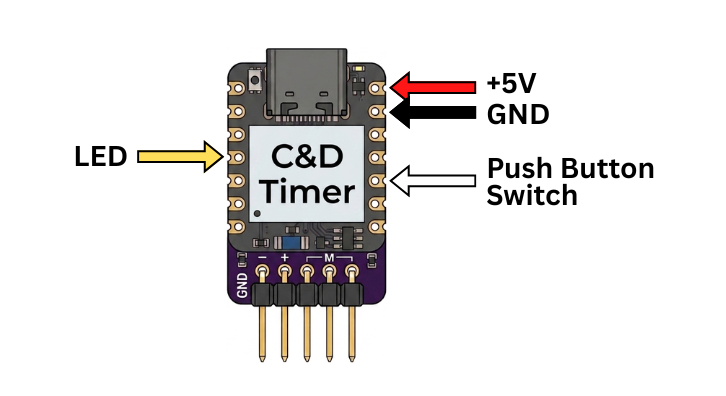
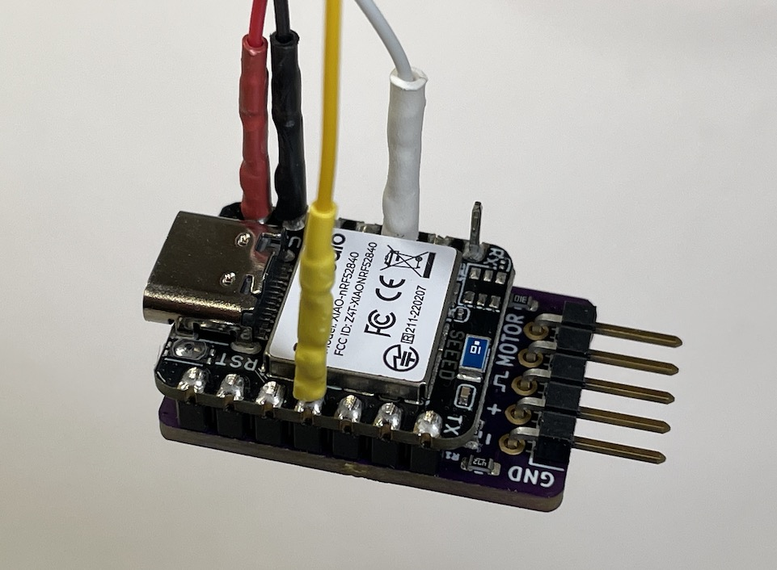
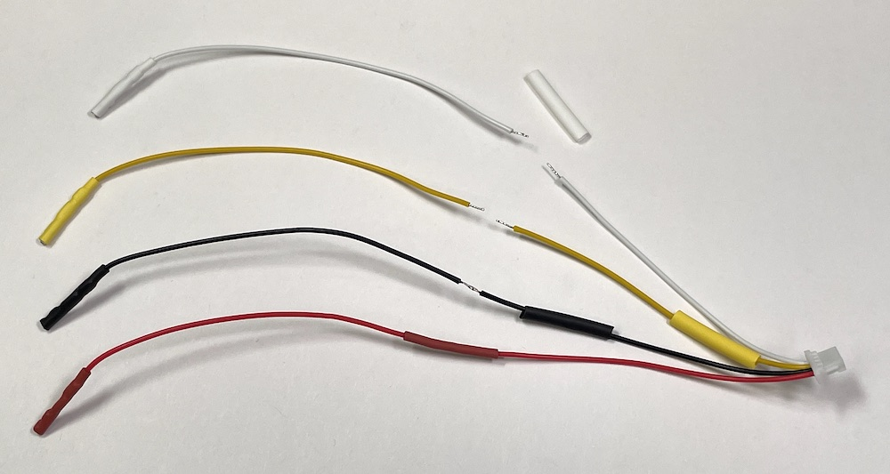
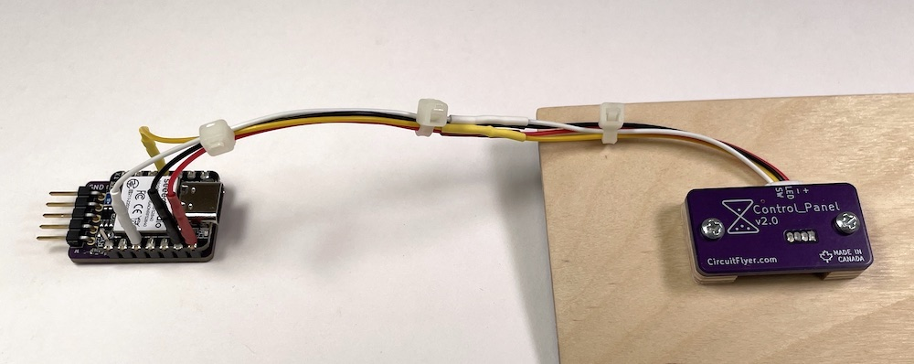
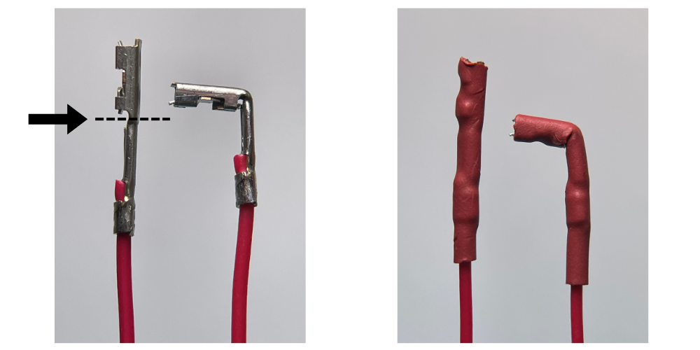
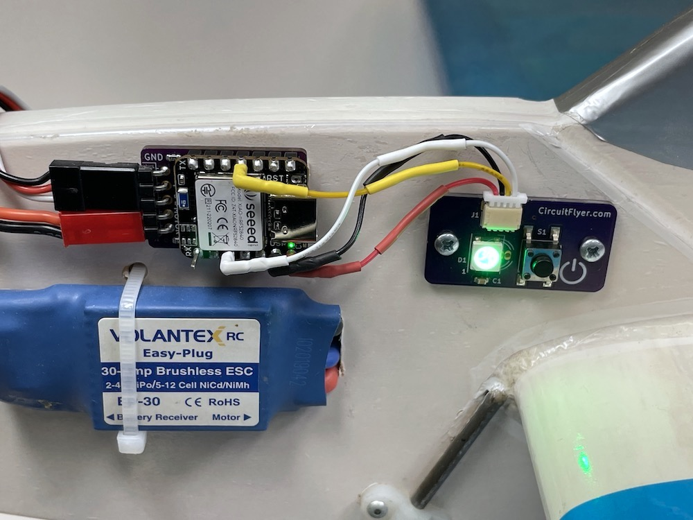



## Connect it up ##

The wiring and connectors supplied in the kit consist of a 4 pin JST-SH connector with 6" (150mm) leads attached plus (4) individual 6" (150mm) wire leads with female crimp to wire receptacles attached.  Also included are (4) lengths of coloured heat shrink tubing.

The JST-SH connector plugs into the receptacle that is mounted on the Contol_Panel printed circuit board.  The female crimp receptacles connect to the individual pins on the Climb_and_Dive timer circuit board as shown below.

Once the location of both the timer and Control_Panel are established, route the connection wires and trim the wires to the exact length needed.  Strip and solder the wires together.

Cut each length of heat shrink tubing in half.  Use one piece to cover the wire solder joints and the other half to insulate the exposed female crimp receptacles.

{: .highlight }
Note: The female crimp receptacles included with the installation kit are genuine Amphenol PV series connectors.  These are the highest quality connectors for use with the square post male header pins used on the Climb_and_Dive timer.  These crimp receptacles feature a a two-piece design with a beryllium copper spring.  For individual connections, the PV series are far superior to the crimp connectors of the cheaper single-piece design found in all hobby grade 'servo' or 'Dupont' connectors.

When connecting to the timer, be sure to orient the female crimp receptacles to align with the square faces of the timer male header pin.

Follow the instructions for the timer installation to complete the system.

{: .highlight }
Note: The 5mm diameter addressable LED used in the Contol_Panel kit will illuminate blue from the time that power is first applied until the time a valid signal is received from the timer microcontroller.  In other words, the LED will illuminate blue when the airplane battery is connected.  After the timer finishes the boot-up process the LED will then turn green.  This is the normal operation for this particular LED.

The capacitive touch pin on the timer remains fully functional and operates in parallel to the push button switch.

## Need some extra room? ##

Some timer installations may not have enough space above the timer to allow for the crimp pin receptacles.  **After** the heat shrink tubing is installed, it is possible to carefully bend the crimp receptacle up to 90 degrees.  Since the bending process can work harden the copper alloy, it is advisable to only perform the bending action one time.

