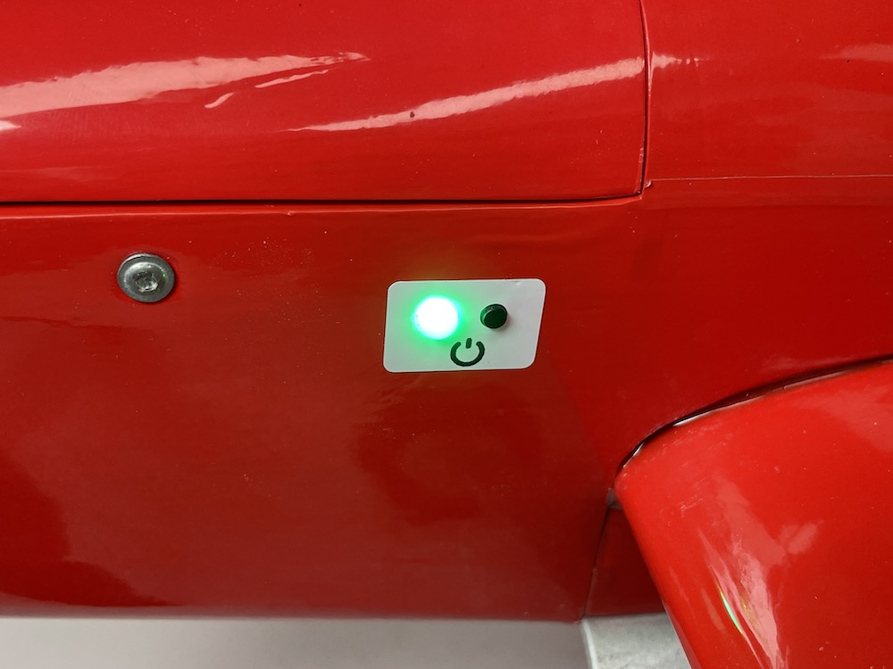
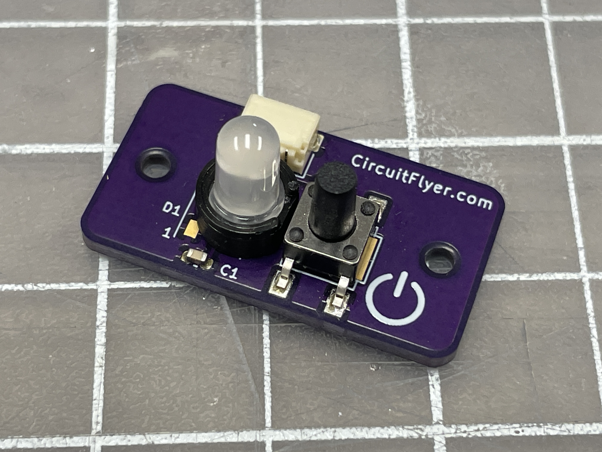
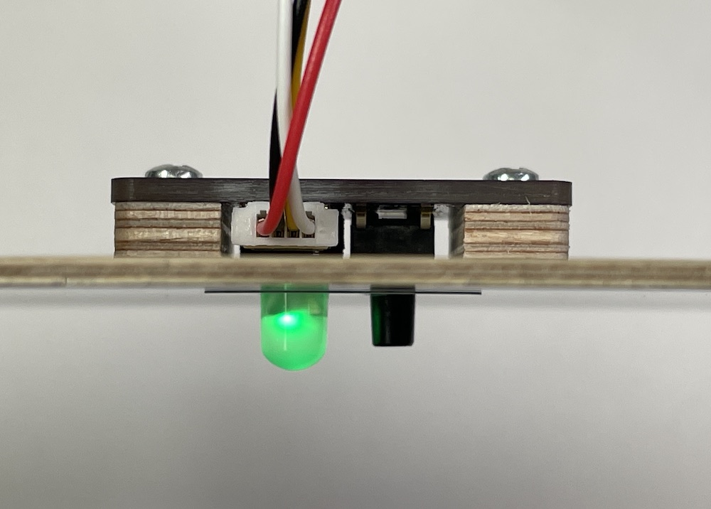
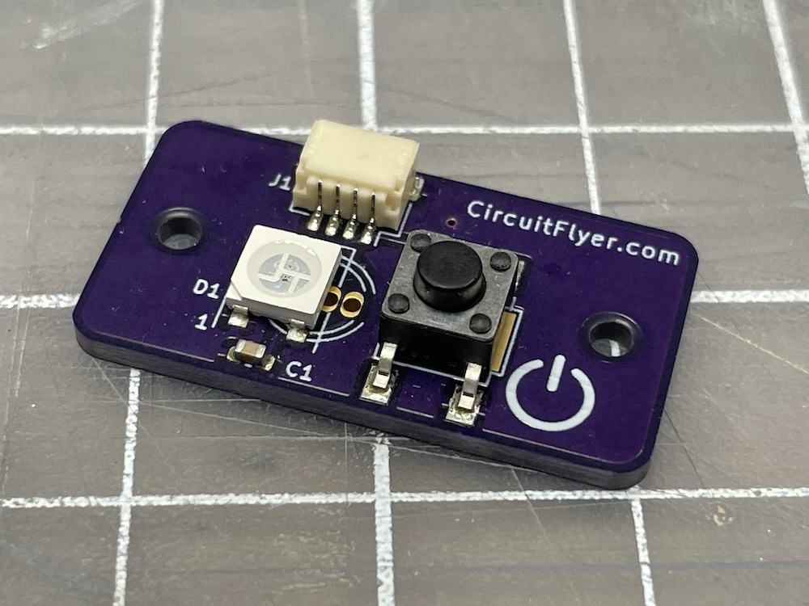
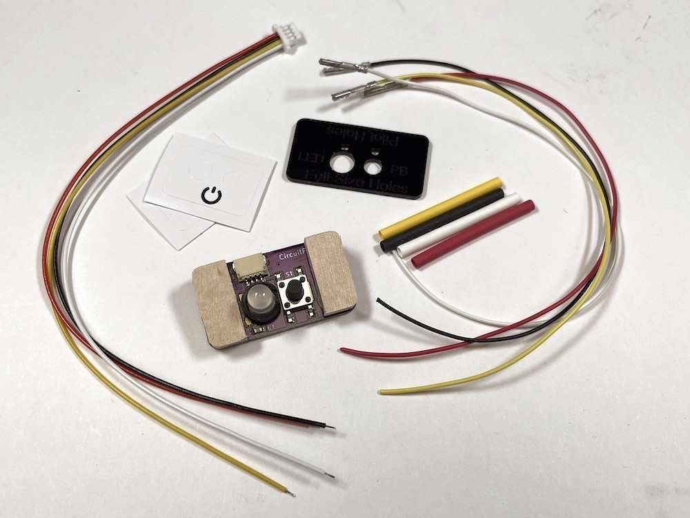
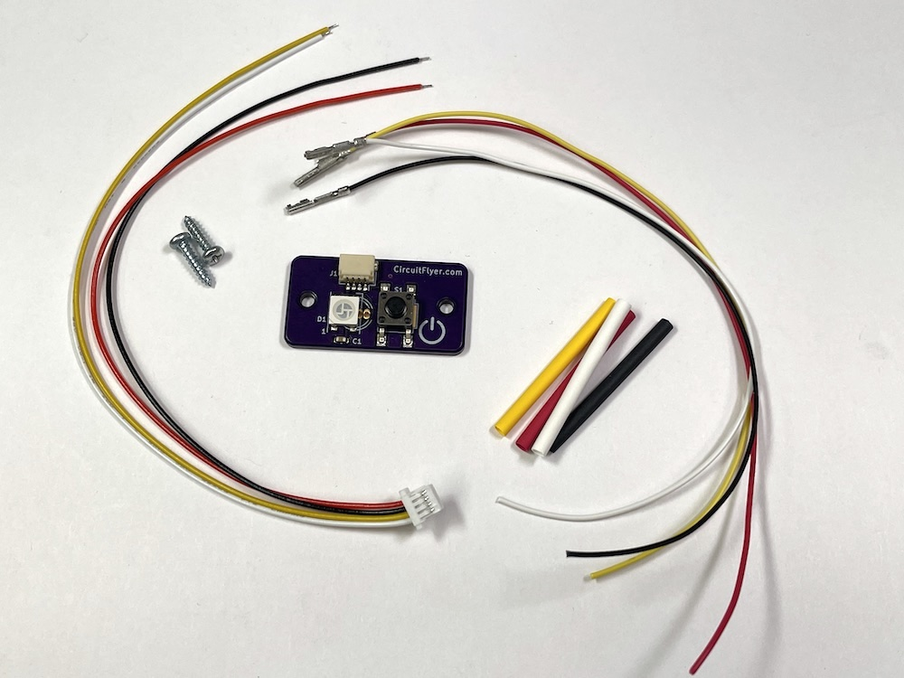


 

# Control_Panel a Remote Timer Interface
{: .text-center }

## What It Is
Control_Panel is a compact package consisting of a start switch and super bright status indicator light.  Visible from 60 ft away even on a sunny day. It is intended to simplify the installation of a remotely mounted user interface for use with CircuitFlyer inspired active/governor timer systems.  

The electrical components are attached to a printed circuit board for easy mounting on the fuselage surface.  For full fuselage model airplanes, the Control_Panel mounts on the inside with the pushbutton switch and LED protruding through two small holes in the fuselage wall for a clean exterior appearance.

A version of the Control_Panel is also available with shorter style components for mounting on the exterior of profile fuselage model aircraft.

The installation kit also includes appropriate connectors and wires to join the Contol_Panel to the timer.  Soldering skills will be required to splice the wires together at the custom length necessary for your installation.

## Installation Kit Details
The base components consists of: 
(1) PCB assembly (pushbutton switch and addressable multicolour LED) 
(1) 4 Pin JST-SH connector with 6” 28 gauge wire leads 
(4) 6” 28 gauge wire leads with genuine Amphenol PV series crimp to wire female receptacles 
(4) Lengths of 1/16" heat shrink tubing 

The full fuselage version includes all of the base components plus: 
(2) 5/32” thick CNC machined plywood spacer blocks 
(2) #2 x 3/16” wood screws 
(1) Laser cut acrylic drill template 
(2) Printed vinyl labels 

The Profile fuselage version includes all of the base components plus: 
(2) #2 x 3/8” wood screws 

Overall dimensions: 17mm x 31mm 
Weight: 3 grams 
Maximum fuselage wall thickness for full fuselage version: 3/16", 5mm

[Click Here to order a **Control_Panel** kit on **Lectronz**](https://lectronz.com/products/control_panel){: .btn .btn-green}

Want some more information about the best timer in the world?  The Climb_and_Dive active/governor timer:

[Click Here for information about the **Climb_and_Dive** timer](https://circuitflyer.com/Climb_and_Dive/){: .btn .btn-blue}

